# 🚀 Tính năng DevShare Lite

## 📋 Tổng quan

**DevShare Lite** là một nền tảng diễn đàn kỹ thuật với đầy đủ tính năng mạng xã hội, được xây dựng bằng **MERN Stack** (MongoDB, Express.js, React, Node.js). Hệ thống cung cấp môi trường để các lập trình viên chia sẻ kiến thức, thảo luận kỹ thuật và xây dựng cộng đồng.

---

## ✨ Các chức năng chính

### 1. 🔐 Hệ thống Authentication & Authorization

#### 1.1 Đăng ký & Đăng nhập

-   **Đăng ký tài khoản** với email và mật khẩu
-   **Đăng nhập** với JWT token

**Giao diện đăng nhập:**
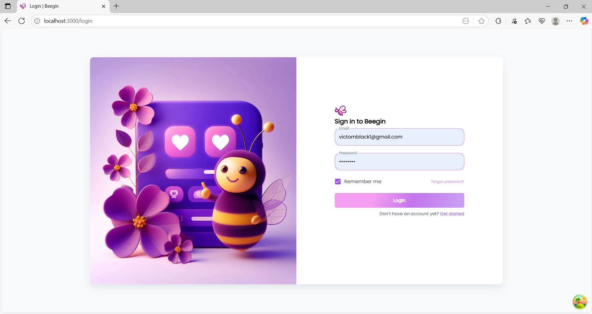

**Quy trình đăng ký 3 bước:**

_Bước 1: Nhập thông tin tài khoản_
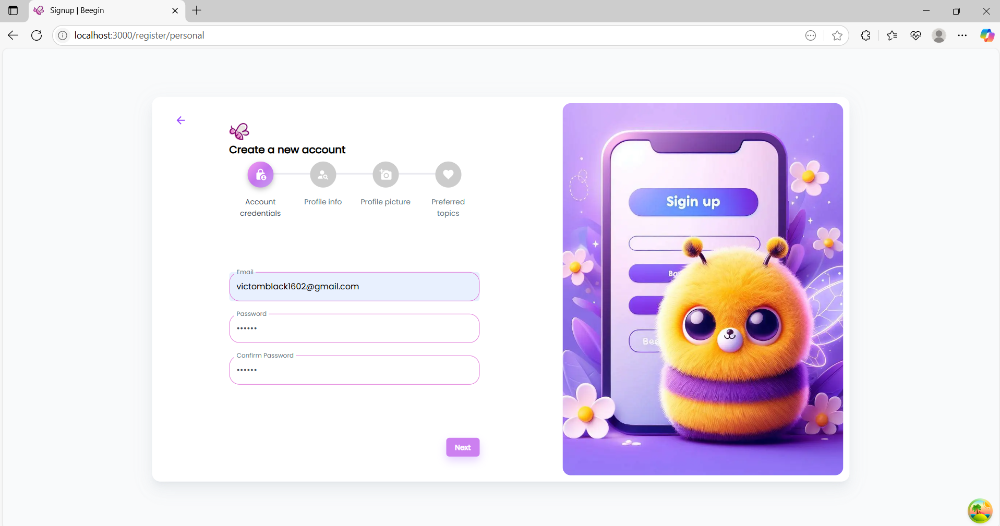

_Bước 2: Thông tin cá nhân_
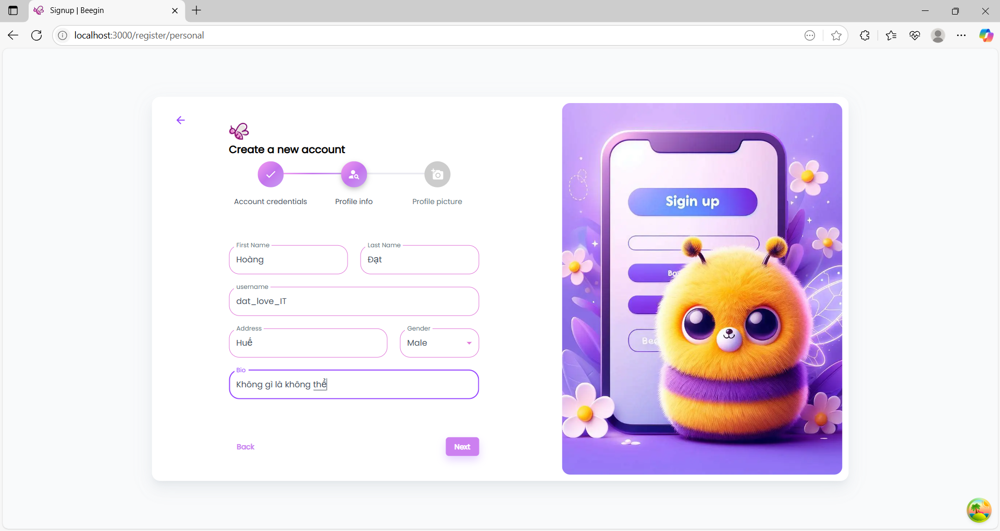

_Bước 3: Hoàn thành đăng ký_
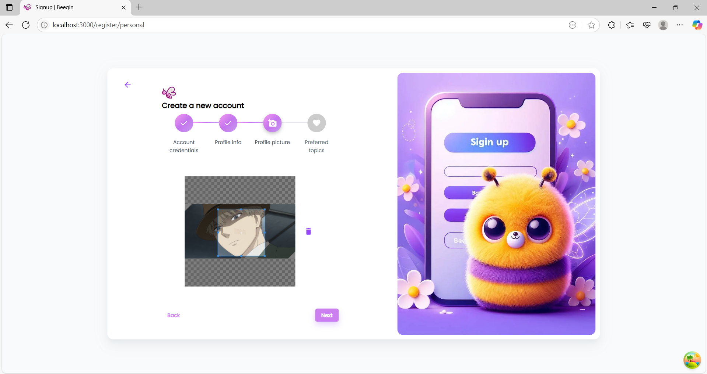

#### 1.2 Phân quyền người dùng

-   **Basic user role** với quyền tạo, sửa, xóa bài viết của chính mình
-   **Protected routes** cho user đã đăng nhập
-   **JWT Token Management** với refresh token

#### 1.3 JWT Token Management

```javascript
// Refresh token để duy trì session
refreshToken: String,    // Stored in database
accessToken: String,     // Short-lived, stored in memory
```

### 2. 👤 Quản lý Profile & User

#### 2.1 Profile cá nhân

-   **Thông tin cơ bản**: Họ tên, giới tính, ngày sinh
-   **Avatar & Background**: Upload ảnh qua Cloudinary
-   **Bio**: Mô tả bản thân
-   **Slug URL**: Profile link dạng `/profile/{slug}`
-   **Chỉnh sửa profile** của chính mình

**Trang profile cá nhân và chỉnh sửa profile:**
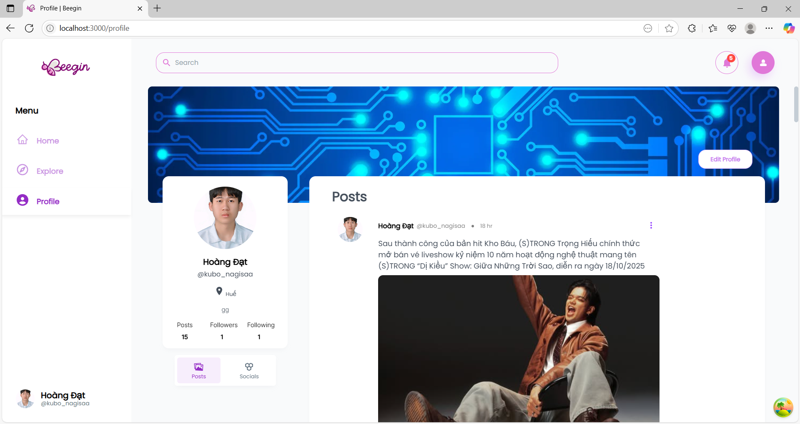

#### 2.2 Trang Profile công khai

-   **Hiển thị thông tin** công khai của user
-   **Danh sách bài viết** của user
-   **Responsive design** cho mobile và desktop

**Trang profile công khai của user khác:**
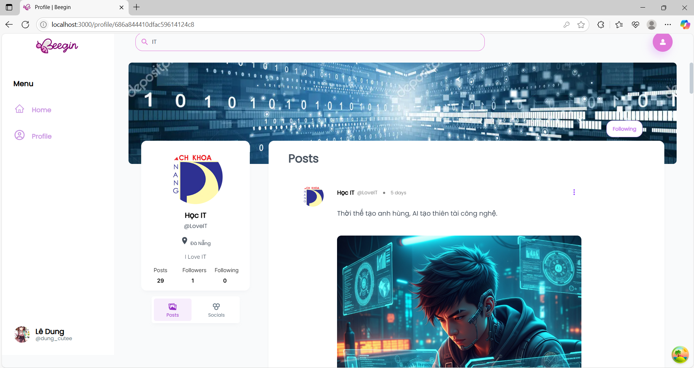

### 3. 📝 Hệ thống Posts (Bài viết)

#### 3.1 Tạo & Chỉnh sửa bài viết

-   **Rich text editor** với Markdown support
-   **Upload multiple images** (tối đa 4 ảnh)
-   **Auto-save draft** functionality
-   **Preview mode** trước khi publish
-   **Chỉnh sửa bài viết** của chính mình
-   **Xóa bài viết** (soft delete)

**Giao diện tạo bài viết mới:**
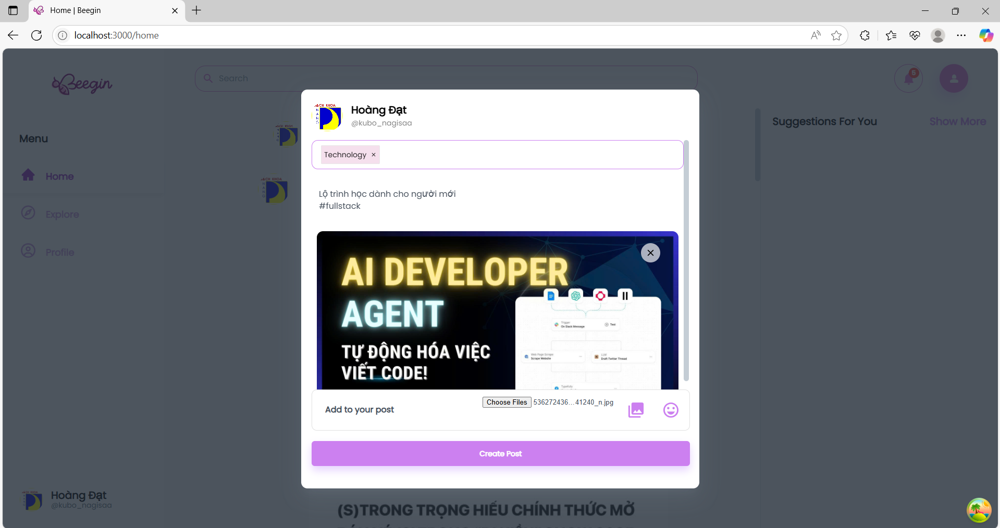

**Giao diện chỉnh sửa bài viết:**
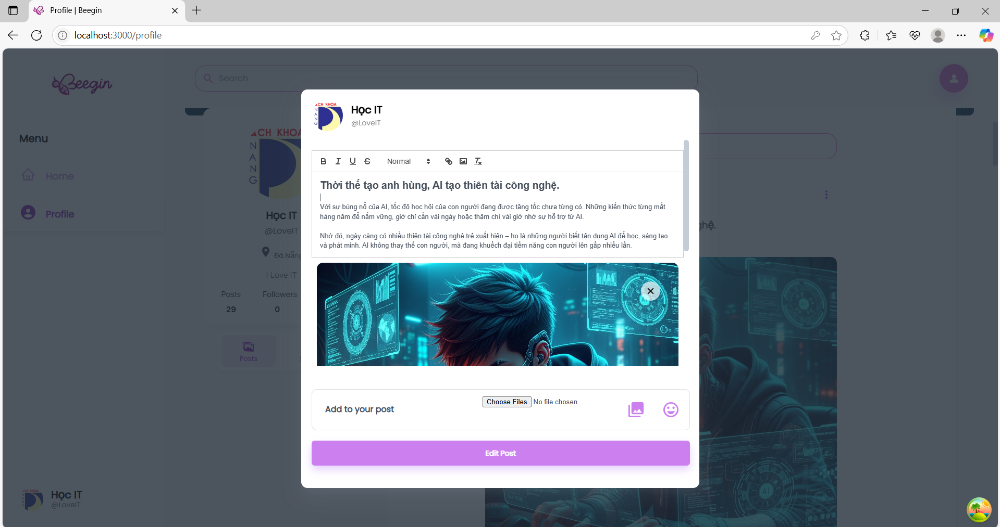

#### 3.2 Hiển thị bài viết

-   **Timeline feed** với infinite scroll
-   **Responsive card layout**
-   **Image gallery** với lightbox
-   **Social interactions**: Like, Comment, Share counts

**Giao diện newsfeed timeline:**
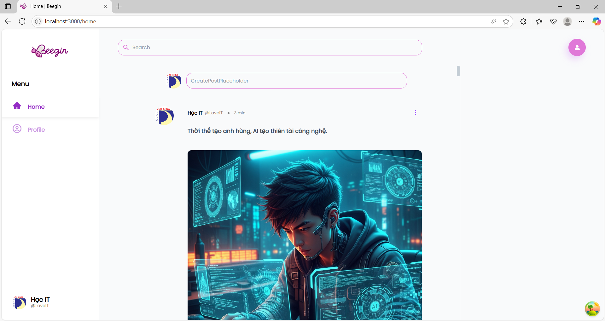

### 4. 🔍 Tìm kiếm & Lọc

#### 4.1 Tìm kiếm Users

-   **Tìm theo tên** (firstname, lastname)
-   **Tìm theo username/slug**
-   **Tìm theo email**
-   **Tìm theo bio** (mô tả cá nhân)
-   **Hiển thị kết quả** với avatar và thông tin cơ bản

**Giao diện tìm kiếm users:**
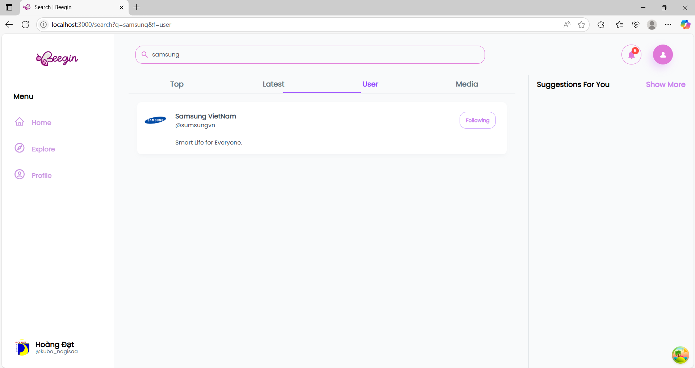

#### 4.2 Tìm kiếm Posts

-   **Tìm theo title** bài viết
-   **Tìm theo content** bài viết
-   **Filter theo user** cụ thể
-   **Sort theo ngày tạo**

**Giao diện tìm kiếm posts:**


### 5. 🔄 Tính năng Share Posts (Chia sẻ)

#### 5.1 Share bài viết

-   **Quote share**: Thêm comment khi share
-   **Original post preview** trong shared post
-   **Share counter** tự động cập nhật
-   **Track sharing activity**

**Modal share bài viết và hiển thị shared post:**
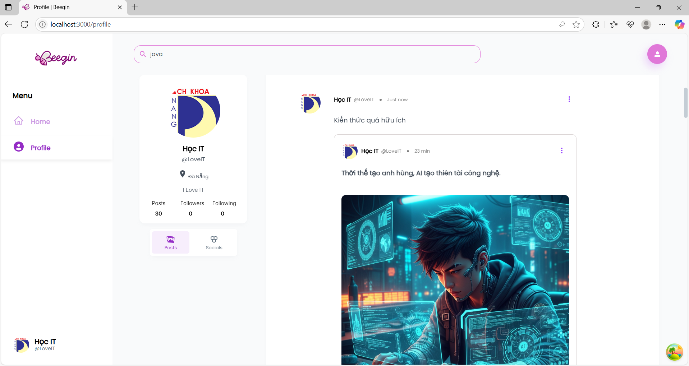

#### 5.2 Shared post display

```javascript
// Structure của shared post
{
  content: "Chia sẻ bài viết hay!",  // User's comment
  parent: {                         // Original post
    content: "Original content...",
    user: { profile: {...} }
  }
}
```

### 6. 💬 Hệ thống Comments (Bình luận)

#### 6.1 Threaded Comments (Cấu trúc cây)

-   **Root comments**: Bình luận gốc
-   **Nested replies**: Reply không giới hạn độ sâu
-   **Visual indentation** cho hierarchy
-   **Collapse/Expand** replies

**Giao diện comment thread với replies:**
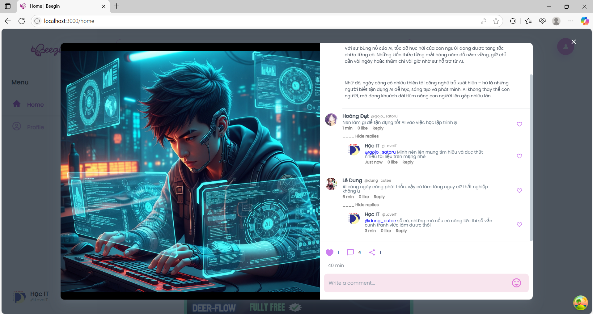

#### 6.2 Comment Features

-   **Real-time comment count** update
-   **Rich text trong comments**
-   **Edit & Delete** own comments chỉ
-   **Reply to comments**

### 7. ❤️ Hệ thống Interactions

#### 7.1 Like Posts & Comments

-   **Toggle like/unlike** với animation
-   **Real-time counter update**
-   **Unique constraint**: 1 user = 1 like per post/comment
-   **Visual feedback** khi đã like

**Giao diện like button với counter:**
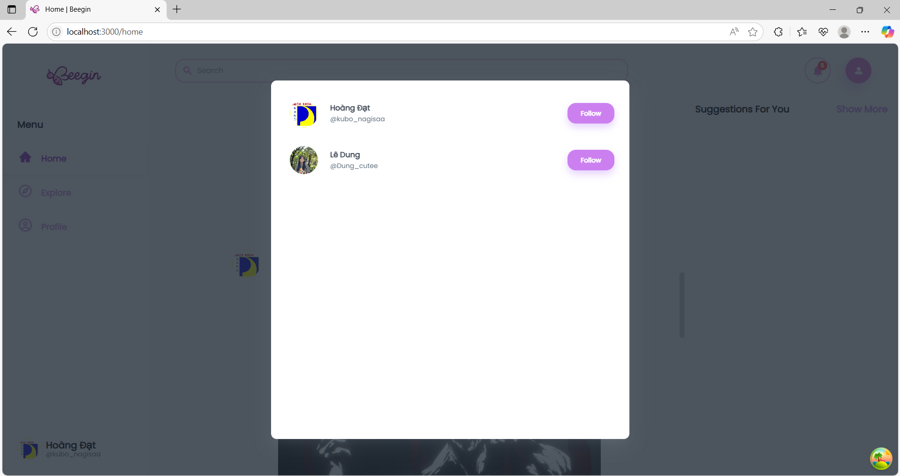

#### 7.2 Social Counters

```javascript
// Auto-calculated counters
post: {
  numLikes: Number,     // Từ LikePost collection
  numComments: Number,  // Từ Comment collection
  numShares: Number     // Từ SharePost collection
}
```

### 8. 📱 Responsive Design

#### 8.1 Desktop-First Development ⚠️

-   **Desktop optimization** đã hoàn thành
-   **Fixed desktop layout** (1200px+ screens)
-   **Desktop navigation** đã được optimize
-   ❌ **Mobile responsive** chưa được implement

#### 8.2 UI/UX Features

-   **Loading states** với skeletons
-   **Infinite scroll** cho timeline (desktop only)
-   **Modal dialogs** cho interactions
-   **Toast notifications** cho feedback

---

## 🔧 Các chức năng nâng cao (Ngoài yêu cầu tối thiểu)

### ✅ **ĐÃ TRIỂN KHAI**

#### 1. 🎯 **Real-time Features**
- **Auto counter updates** cho likes, comments, shares
- **Optimistic UI updates** với instant feedback
- **Real-time activity tracking** cho user interactions

#### 2. 🚀 **Performance Optimizations**
- **Database indexing** cho search queries
- **Mongoose populate optimization** tránh N+1 queries
- **React optimization** (memo, useMemo, useCallback)
- **Image lazy loading** và compression

#### 3. 🔍 **Advanced Search System**
```javascript
// Multi-field search cho users và posts
Profile.find({
    $or: [
        { firstname: { $regex: searchQuery, $options: "i" } },
        { lastname: { $regex: searchQuery, $options: "i" } },
        { bio: { $regex: searchQuery, $options: "i" } }
    ]
});
```
- **Dual search**: Users + Posts riêng biệt
- **Real-time search** với debouncing
- **Search result optimization**

#### 4. 🎨 **Enhanced UI/UX**
- **Rich text editor** cho posts
- **Image carousel** với lightbox
- **Infinite scroll** timeline
- **Modal system** với keyboard navigation
- **Loading skeletons** và toast notifications

#### 5. 🔐 **Security Enhancements**
```javascript
// Input validation & XSS protection
const sanitizedContent = DOMPurify.sanitize(userInput);
const schema = Joi.object({
    email: Joi.string().email().required(),
    password: Joi.string().min(8).required()
});
```
- **Password hashing** với bcrypt
- **JWT security** với refresh tokens
- **CORS và rate limiting** cơ bản

#### 6. 📷 **File Upload System**
- **Cloudinary integration** với auto-optimization
- **Multiple image uploads** (max 4 ảnh/post)
- **Drag & drop interface** với progress indicators

---

## ⚠️ Các vấn đề gặp phải và giải pháp

### 1. 🐛 Performance Issues

#### Vấn đề: N+1 Query Problem

```javascript
// Vấn đề: Query riêng lẻ cho mỗi user
posts.forEach((post) => {
    User.findById(post.user); // N queries
});
```

#### Giải pháp: Mongoose Population

```javascript
// Giải pháp: Sử dụng populate để optimize
Post.find().populate({
    path: "user",
    populate: { path: "profile" },
});
```

### 2. 🔄 State Management Complexity

#### Vấn đề: Prop Drilling

-   **Deep component nesting** khiến state truyền qua nhiều level
-   **Component re-render** không cần thiết

#### Giải pháp: Context API + useReducer

```javascript
// Global state management
const PostContext = createContext();
const usePostContext = () => useContext(PostContext);
```

### 3. 📱 Mobile Responsiveness

#### Vấn đề: Layout Breaking

-   **Fixed widths** không phù hợp mobile
-   **Touch events** không hoạt động smooth

#### Giải pháp: Mobile-First Design

```css
/* Mobile-first CSS approach */
.container {
    width: 100%;
    padding: 1rem;
}

@media (min-width: 768px) {
    .container {
        max-width: 1200px;
        margin: 0 auto;
    }
}
```

### 4. 🔍 Search Performance

#### Vấn đề: Slow Search Queries

-   **Regex queries** có thể chậm với large datasets
-   **No indexing** cho search fields

#### Giải pháp: Database Indexing

```javascript
// Tạo text indexes cho search
db.profiles.createIndex({
    firstname: "text",
    lastname: "text",
    bio: "text",
});

db.posts.createIndex({
    title: "text",
    content: "text",
});
```

### 5. 🖼️ Image Upload & Storage

#### Vấn đề: Large File Handling

-   **Slow upload speeds**
-   **Browser memory issues** với large images

#### Giải pháp: Cloudinary + Compression

```javascript
// Client-side image compression
const compressImage = (file) => {
    return new Promise((resolve) => {
        new Compressor(file, {
            quality: 0.8,
            maxWidth: 1920,
            success: resolve,
        });
    });
};
```

---

## 🚧 Các giới hạn đã biết

### 1. 👑 Admin & Moderation

#### Missing Admin Features

-   **Không có admin dashboard** để quản lý hệ thống
-   **Không có content moderation** tools
-   **Không có user management** từ admin
-   **Không có system analytics** và reports

### 2. 🔍 Search Limitations

#### Current Search Constraints

-   **Chỉ search basic fields**: name, email, bio, post content
-   **Không có fuzzy matching** hoặc typo tolerance
-   **Không có search filters** advanced (date range, categories)
-   **Không có search suggestions** hoặc autocomplete
-   **Không có search analytics**
-   **Không có forgot password**

#### Missing Search Features

-   **Global search** across all content types
-   **Search in comments**
-   **Tag-based search**
-   **Advanced boolean operators**

### 3. 📊 Analytics & Insights

#### Data Limitations

-   **Không có user analytics** dashboard
-   **Không có engagement metrics** tracking
-   **Không có popular content** identification
-   **Không có growth metrics**

### 4. 📱 Mobile Experience

#### Known Issues

-   **Upload progress** chưa hiển thị trên mobile
-   **Touch gestures** chưa được optimize hoàn toàn
-   **Offline support** chưa được implement
-   **Push notifications** chưa có

### 5. 🔐 Security & Moderation

#### Current Limitations

-   **Không có content reporting** system
-   **Không có user blocking** functionality
-   **Không có automated moderation**
-   **Basic rate limiting** chưa sophisticated
-   **Không có 2FA** (Two-Factor Authentication)

### 6. 🎨 UI/UX Limitations

#### Design Constraints

-   **Không có dark mode** theme switching
-   **Limited customization** options cho users
-   **Không có accessibility features** cho disabled users
-   **Không có email notifications** cho activities

---

## 🚀 Định hướng phát triển tương lai

### 1. 🎯 Immediate Improvements (1-3 tháng)

#### 1.1 Admin System Development

-   [ ] **Admin dashboard** với user management
-   [ ] **Content moderation** tools
-   [ ] **System analytics** và reporting
-   [ ] **User role management**
-   [ ] **Content approval** workflow


#### 1.2 Enhanced Search

-   [ ] **Full-text search** với MongoDB Atlas Search
-   [ ] **Search filters** (date, user, category)
-   [ ] **Search suggestions** và autocomplete
-   [ ] **Search in comments** functionality
-   [ ] **Advanced search syntax**

#### 1.3 Performance Enhancements

-   [ ] **Redis caching** cho frequently accessed data
-   [ ] **Database indexing optimization**
-   [ ] **CDN setup** cho static assets
-   [ ] **Bundle optimization** và code splitting

### 2. 🔧 Medium-term Features (3-6 tháng)

#### 2.1 Advanced Social Features

-   [ ] **Follow/Unfollow users** functionality
-   [ ] **Private messaging** system
-   [ ] **User mentions** trong posts và comments
-   [ ] **Hashtag system** cho categorization
-   [ ] **Trending topics** identification

#### 2.2 Content Enhancement

-   [ ] **Categories/Tags** cho posts
-   [ ] **Rich text editor** với code syntax highlighting
-   [ ] **Markdown support** cho technical posts
-   [ ] **Video upload** support
-   [ ] **File attachments** cho documents

#### 2.3 Notifications & Communication

-   [ ] **Email notifications** cho activities
-   [ ] **In-app notifications** system
-   [ ] **Push notifications** cho web
-   [ ] **Notification preferences** management

#### 2.4 Moderation & Safety

-   [ ] **Content reporting** system
-   [ ] **User blocking** functionality
-   [ ] **Automated content filtering**
-   [ ] **Community guidelines** enforcement

### 3. 🚀 Long-term Vision (6-12 tháng)

#### 3.1 Platform Expansion

-   [ ] **Mobile app** (React Native)
-   [ ] **Desktop app** (Electron)
-   [ ] **Browser extension** cho quick sharing
-   [ ] **API marketplace** cho third-party integrations

#### 3.2 Advanced Features

-   [ ] **AI-powered recommendations**
-   [ ] **Advanced search** với Elasticsearch
-   [ ] **Real-time collaboration** tools
-   [ ] **Integration với GitHub/GitLab**
-   [ ] **Code snippet sharing** với syntax highlighting

#### 3.3 Community Features

-   [ ] **Groups/Communities** creation
-   [ ] **Event scheduling** cho meetups
-   [ ] **Job board** integration
-   [ ] **Mentorship program** matching

### 4. 🏗️ Technical Infrastructure

#### 4.1 Scalability Improvements

-   [ ] **Microservices architecture**
-   [ ] **Database sharding** strategy
-   [ ] **Load balancing** setup
-   [ ] **CDN và edge computing**

#### 4.2 DevOps & Monitoring

-   [ ] **Comprehensive logging** system
-   [ ] **Performance monitoring** tools
-   [ ] **Automated testing** pipeline
-   [ ] **Security auditing** tools

### 5. 🌍 Advanced Search & Discovery

#### 5.1 Search Engine Enhancement

-   [ ] **Elasticsearch integration** cho advanced search
-   [ ] **Machine learning** cho search relevance
-   [ ] **Semantic search** capabilities
-   [ ] **Voice search** functionality

#### 5.2 Content Discovery

-   [ ] **Recommendation engine** cho personalized content
-   [ ] **Trending algorithms** cho popular content
-   [ ] **Related posts** suggestions
-   [ ] **User interests** tracking và matching

---

## 📊 Current Feature Status

### ✅ Implemented Features

-   **User Authentication** (Register, Login, JWT)
-   **Profile Management** (Create, Edit, View)
-   **Post Management** (CRUD operations)
-   **Comment System** (Threaded comments)
-   **Like System** (Posts and Comments)
-   **Share System** (Quote sharing)
-   **Basic Search** (Users and Posts)
-   **File Upload** (Images via Cloudinary)
-   **Responsive Design** (Mobile-friendly)

### 🚧 Partially Implemented

-   **Search Functionality** (Basic regex search only)
-   **User Permissions** (Basic user role only)
-   **Real-time Updates** (Counter updates only)

### ❌ Not Implemented Yet

-   **Admin System** (Complete admin functionality)
-   **Advanced Search** (Full-text, filters, suggestions)
-   **Notifications** (Email, push, in-app)
-   **Moderation Tools** (Reporting, blocking)
-   **Analytics Dashboard**
-   **Mobile App**

---

## 🎯 Kết luận

**DevShare Lite** trong phiên bản hiện tại đã hoàn thành được các tính năng cốt lõi của một mạng xã hội kỹ thuật:

✅ **Core Social Features**: Posts, Comments, Likes, Shares
✅ **User Management**: Authentication, Profiles
✅ **Basic Search**: Users và Posts
✅ **File Upload**: Images qua Cloudinary
✅ **Responsive Design**: Mobile-friendly interface
✅ **Real-time Interactions**: Live counters và updates

**Những điểm mạnh:**

-   Architecture vững chắc với MERN stack
-   Database design tối ưu cho social features
-   User experience mượt mà với real-time updates
-   Security cơ bản với JWT authentication
-   Performance tốt với proper indexing

**Những hạn chế cần cải thiện:**

-   Thiếu admin system cho content management
-   Search functionality còn basic
-   Chưa có notification system
-   Thiếu moderation tools cho community safety

Với foundation hiện tại, **DevShare Lite** sẵn sàng cho việc mở rộng thêm các tính năng advanced và có thể phát triển thành một platform hoàn chỉnh phục vụ cộng đồng developers.

=
