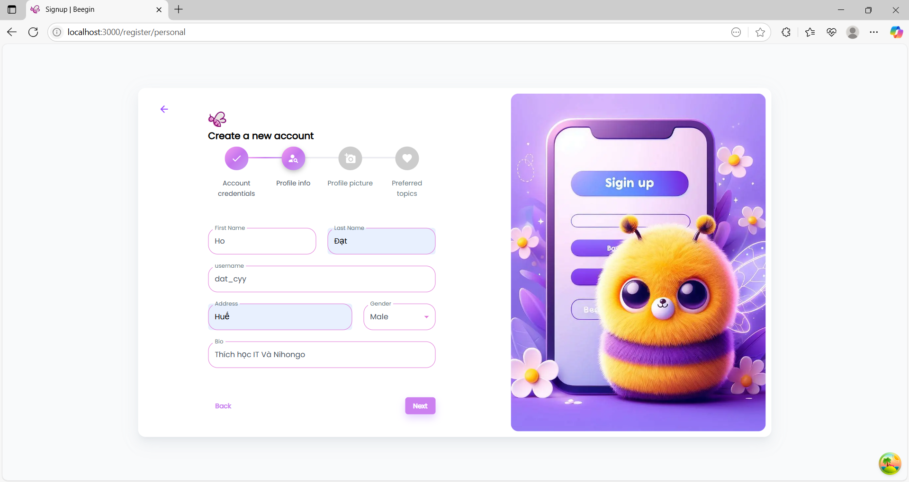
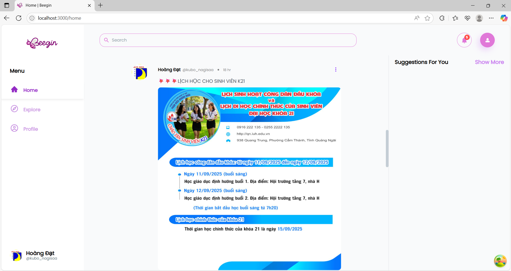
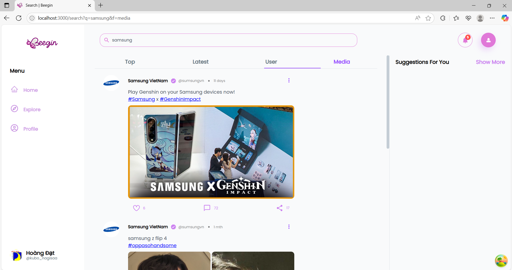

# 🚀 BeeSocial Features

## 📋 Overview

**BeeSocial** is a technical social network platform built with the **MERN Stack** (MongoDB, Express.js, React, Node.js), offering a full suite of social features.

---

## ✨ Main Features

### 0. 📝 Registration Process

#### 0.1 Account Type Selection

-   Users choose between **Personal** or **Business** account types to start registration.
-   Example interface:
    

#### 0.2 4-Step Registration

_Step 1: Account Information_

-   Enter email, password, confirm password.
-   Example interface:
    

_Step 2: Personal Information_

-   Enter full name, username, address, gender, bio.
-   Example interface:
    

_Step 3: Profile Picture_

-   Upload and crop profile picture.
-   Example interface:
    

_Step 4: Select Preferred Topics_

-   Choose at least 3 topics of interest for personalized content.
-   Example interface:
    

### 1. 🔐 Authentication & Authorization System

#### 1.1 Login

-   **Login** with JWT token
-   Login interface:
    

#### 1.2 User Roles

-   **Basic user role** with permissions to create, edit, and delete own posts
-   **Protected routes** for authenticated users
-   **JWT Token Management** with refresh token

#### 1.3 JWT Token Management

```javascript
// Refresh token to maintain session
refreshToken: String,    // Stored in database
accessToken: String,     // Short-lived,
```

### 2. 👤 Profile & User Management

#### 2.1 Personal Profile

-   **Basic info**: Full name, gender, date of birth
-   **Avatar & Background**: Upload images via Cloudinary
-   **Bio**: Personal description
-   **Slug URL**: Profile link as `/profile/{slug}`
-   **Edit own profile**

**Personal profile and edit profile page:**


#### 2.2 Public Profile Page

-   **Display public info** of user
-   **List of user's posts**
-   **Responsive design** for mobile and desktop

**Other user's public profile page:**


### 3. 📝 Posts System

#### 3.1 Create & Edit Posts

-   **Upload multiple images** (up to 4 images)
-   **Auto-save draft** functionality
-   **Preview mode** before publishing
-   **Edit own posts**
-   **Delete posts** (soft delete)

**Create post interface:**


**Edit post interface:**


#### 3.2 Post Display

-   **Timeline feed** with infinite scroll
-   **Responsive card layout**
-   **Image gallery** with lightbox
-   **Social interactions**: Like, Comment, Share counts

**Newsfeed timeline interface:**


### 4. 🔍 Search & Filter

#### 4.1 Search Users

-   **Search by name** (firstname, lastname)
-   **Search by username/slug**
-   **Search by email**
-   **Search by bio** (personal description)
-   **Display results** with avatar and basic info

**User search interface:**


#### 4.2 Search Posts

-   **Search by post title**
-   **Search by post content**
-   **Filter by specific user**
-   **Sort by creation date**

**Post search interface:**


### 5. 🔄 Share Posts Feature

#### 5.1 Share Posts

-   **Quote share**: Add comment when sharing
-   **Original post preview** in shared post
-   **Share counter** auto-updates
-   **Track sharing activity**

**Share post modal and shared post display:**


#### 5.2 Shared Post Display

```javascript
// Shared post structure
{
  content: "Sharing a great post!",  // User's comment
  parent: {                         // Original post
    content: "Original content...",
    user: { profile: {...} }
  }
}
```

### 6. 💬 Comments System

#### 6.1 Threaded Comments (Tree Structure)

-   **Root comments**
-   **Nested replies**: Unlimited depth
-   **Visual indentation** for hierarchy
-   **Collapse/Expand** replies

**Comment thread interface with replies:**


#### 6.2 Comment Features

-   **Real-time comment count** update
-   **Rich text in comments**
-   **Edit & Delete** own comments only
-   **Reply to comments**

### 7. ❤️ Interactions System

#### 7.1 Like Posts & Comments

-   **Toggle like/unlike** with animation
-   **Real-time counter update**
-   **Unique constraint**: 1 user = 1 like per post/comment
-   **Visual feedback** when liked

**Like button interface with counter:**


#### 7.2 Social Counters

```javascript
// Auto-calculated counters
post: {
  numLikes: Number,     // From LikePost collection
  numComments: Number,  // From Comment collection
  numShares: Number     // From SharePost collection
}
```

### 8. 📱 Responsive Design

#### 8.1 Desktop-First Development ⚠️

-   **Desktop optimization** completed
-   **Fixed desktop layout** (1200px+ screens)
-   **Desktop navigation** optimized
-   ❌ **Mobile responsive** not yet implemented

#### 8.2 UI/UX Features

-   **Loading states** with skeletons
-   **Infinite scroll** for timeline (desktop only)
-   **Modal dialogs** for interactions
-   **Toast notifications** for feedback

### 9. 🔔 Notification System

#### 9.1 Notification Features

-   **In-app notifications** for activities: like, comment, share, mention
-   **Notification bell** with unread badge
-   **Notification list** with avatar, content, time
-   **Mark as read** and delete notifications
-   **Real-time notification updates** on new events

**Notification system interface:**


#### 9.2 Notification Structure

```javascript
// Basic notification structure
{
  type: "like" | "comment" | "share" | "mention",
  content: "User A liked your post",
  user: { profile: {...} },
  post: { ... },
  isRead: false,
  createdAt: Date
}
```

---

## 🔧 Advanced Features (Beyond Minimum Requirements)

### ✅ **IMPLEMENTED**

#### 1. 🎯 **Real-time Features**

-   **Auto counter updates** for likes, comments, shares
-   **Optimistic UI updates** with instant feedback
-   **Real-time activity tracking** for user interactions

#### 2. 🚀 **Performance Optimizations**

-   **Database indexing** for search queries
-   **Mongoose populate optimization** to avoid N+1 queries
-   **React optimization** (memo, useMemo, useCallback)
-   **Image lazy loading** and compression

#### 3. 🔍 **Advanced Search System**

```javascript
// Multi-field search for users and posts
Profile.find({
    $or: [
        { firstname: { $regex: searchQuery, $options: "i" } },
        { lastname: { $regex: searchQuery, $options: "i" } },
        { bio: { $regex: searchQuery, $options: "i" } },
    ],
});
```

-   **Dual search**: Separate for Users + Posts
-   **Real-time search** with debouncing
-   **Search result optimization**

#### 4. 🎨 **Enhanced UI/UX**

-   **Image carousel** with lightbox
-   **Infinite scroll** timeline
-   **Modal system** with keyboard navigation
-   **Loading skeletons** and toast notifications

#### 5. 🔐 **Security Enhancements**

```javascript
// Input validation & XSS protection
const sanitizedContent = DOMPurify.sanitize(userInput);
const schema = Joi.object({
    email: Joi.string().email().required(),
    password: Joi.string().min(8).required(),
});
```

-   **Password hashing** with bcrypt
-   **JWT security** with refresh tokens
-   **Basic CORS and rate limiting**

#### 6. 📷 **File Upload System**

-   **Cloudinary integration** with auto-optimization
-   **Multiple image uploads** (max 4 images/post)
-   **Drag & drop interface** with progress indicators

---

## ⚠️ Known Issues & Solutions

### 1. 🐛 Performance Issues

#### Issue: N+1 Query Problem

```javascript
// Problem: Separate query for each user
posts.forEach((post) => {
    User.findById(post.user); // N queries
});
```

#### Solution: Mongoose Population

```javascript
// Solution: Use populate to optimize
Post.find().populate({
    path: "user",
    populate: { path: "profile" },
});
```

### 2. 🔄 State Management Complexity

#### Issue: Prop Drilling

-   **Deep component nesting** causes state to pass through many levels
-   **Unnecessary component re-renders**

#### Solution: Context API + useReducer

```javascript
// Global state management
const PostContext = createContext();
const usePostContext = () => useContext(PostContext);
```

### 3. 📱 Mobile Responsiveness

#### Issue: Layout Breaking

-   **Fixed widths** not suitable for mobile
-   **Touch events** not smooth

#### Solution: Mobile-First Design

```css
/* Mobile-first CSS approach */
.container {
    width: 100%;
    padding: 1rem;
}

@media (min-width: 768px) {
    .container {
        max-width: 1200px;
        margin: 0 auto;
    }
}
```

### 4. 🔍 Search Performance

#### Issue: Slow Search Queries

-   **Regex queries** can be slow with large datasets
-   **No indexing** for search fields

#### Solution: Database Indexing

```javascript
// Create text indexes for search
db.profiles.createIndex({
    firstname: "text",
    lastname: "text",
    bio: "text",
});

db.posts.createIndex({
    title: "text",
    content: "text",
});
```

### 5. 🖼️ Image Upload & Storage

#### Issue: Large File Handling

-   **Slow upload speeds**
-   **Browser memory issues** with large images

#### Solution: Cloudinary + Compression

```javascript
// Client-side image compression
const compressImage = (file) => {
    return new Promise((resolve) => {
        new Compressor(file, {
            quality: 0.8,
            maxWidth: 1920,
            success: resolve,
        });
    });
};
```

---

## 🚧 Known Limitations

### 1. 👑 Admin & Moderation

#### Missing Admin Features

-   **No admin dashboard** for system management
-   **No content moderation** tools
-   **No user management** from admin
-   **No system analytics** and reports

### 2. 🔍 Search Limitations

#### Current Search Constraints

-   **Only basic field search**: name, email, bio, post content
-   **No fuzzy matching** or typo tolerance
-   **No advanced search filters** (date range, categories)
-   **No search suggestions** or autocomplete
-   **No search analytics**
-   **No forgot password**

#### Missing Search Features

-   **Global search** across all content types
-   **Search in comments**
-   **Tag-based search**
-   **Advanced boolean operators**

### 3. 📊 Analytics & Insights

#### Data Limitations

-   **No user analytics** dashboard
-   **No engagement metrics** tracking
-   **No growth metrics**

### 4. 📱 Mobile Experience

#### Known Issues

-   **Upload progress** not shown on mobile
-   **Touch gestures** not fully optimized
-   **Offline support** not implemented
-   **Push notifications** not available

### 5. 🔐 Security & Moderation

#### Current Limitations

-   **No content reporting** system
-   **No user blocking** functionality
-   **No automated moderation**
-   **Basic rate limiting** not sophisticated
-   **No 2FA** (Two-Factor Authentication)

### 6. 🎨 UI/UX Limitations

#### Design Constraints

-   **No dark mode** theme switching
-   **Limited customization** options for users
-   **No accessibility features** for disabled users

---

## 🚀 Future Development Roadmap

### 1. 🎯 Short-term Improvements (1-3 months)

#### 1.1 Admin System Development

-   [ ] **Admin dashboard** for user management
-   [ ] **Content moderation** tools
-   [ ] **System analytics** and reporting
-   [ ] **User role management**
-   [ ] **Content approval** workflow

#### 1.2 Enhanced Search

-   [ ] **Full-text search** with MongoDB Atlas Search
-   [ ] **Search filters** (date, user, category)
-   [ ] **Search suggestions** and autocomplete
-   [ ] **Search in comments** functionality
-   [ ] **Advanced search syntax**

#### 1.3 Performance Enhancements

-   [ ] **Redis caching** for frequently accessed data
-   [ ] **Database indexing optimization**
-   [ ] **CDN setup** for static assets
-   [ ] **Bundle optimization** and code splitting

### 2. 🔧 Medium-term Features (3-6 months)

#### 2.1 Advanced Social Features

-   [ ] **Private messaging** system
-   [ ] **User mentions** in posts and comments
-   [ ] **Trending topics** identification

#### 2.2 Content Enhancement

-   [ ] **Rich text editor** with code syntax highlighting
-   [ ] **Markdown support** for technical posts
-   [ ] **File attachments** for documents

#### 2.3 Notifications & Communication

-   [ ] **Email notifications** for activities
-   [ ] **In-app notifications** system
-   [ ] **Push notifications** for web
-   [ ] **Notification preferences** management

#### 2.4 Moderation & Safety

-   [ ] **Content reporting** system
-   [ ] **User blocking** functionality
-   [ ] **Automated content filtering**
-   [ ] **Community guidelines** enforcement

### 3. 🚀 Long-term Vision (6-12 months)

#### 3.1 Platform Expansion

-   [ ] **Mobile app** (React Native)
-   [ ] **Desktop app** (Electron)
-   [ ] **Browser extension** for quick sharing
-   [ ] **API marketplace** for third-party integrations

#### 3.2 Advanced Features

-   [ ] **AI-powered recommendations**
-   [ ] **Advanced search** with Elasticsearch
-   [ ] **Real-time collaboration** tools
-   [ ] **Integration with GitHub/GitLab**
-   [ ] **Code snippet sharing** with syntax highlighting

#### 3.3 Community Features

-   [ ] **Groups/Communities** creation
-   [ ] **Event scheduling** for meetups
-   [ ] **Job board** integration
-   [ ] **Mentorship program** matching

### 4. 🏗️ Technical Infrastructure

#### 4.1 Scalability Improvements

-   [ ] **Microservices architecture**
-   [ ] **Database sharding** strategy
-   [ ] **Load balancing** setup
-   [ ] **CDN and edge computing**

#### 4.2 DevOps & Monitoring

-   [ ] **Comprehensive logging** system
-   [ ] **Performance monitoring** tools
-   [ ] **Automated testing** pipeline
-   [ ] **Security auditing** tools

### 5. 🌍 Advanced Search & Discovery

#### 5.1 Search Engine Enhancement

-   [ ] **Elasticsearch integration** for advanced search
-   [ ] **Machine learning** for search relevance
-   [ ] **Semantic search** capabilities
-   [ ] **Voice search** functionality

#### 5.2 Content Discovery

-   [ ] **Recommendation engine** for personalized content
-   [ ] **Trending algorithms** for popular content
-   [ ] **Related posts** suggestions
-   [ ] **User interests** tracking and matching

---

## 📊 Current Feature Status

### ✅ Implemented

-   **User Authentication** (Register, Login, JWT)
-   **Profile Management** (Create, Edit, View)
-   **Post Management** (CRUD)
-   **Comment System** (Threaded comments)
-   **Notifications** (Email, push, in-app)
-   **Like System** (Posts and Comments)
-   **Share System** (Quote sharing)
-   **Basic Search** (Users and Posts)
-   **File Upload** (Images via Cloudinary)
-   **Responsive Design** (Mobile-friendly)

### 🚧 In Progress

-   **Advanced Search** (Currently only basic regex)
-   **User Permissions** (Only basic roles)
-   **Real-time Updates** (Only counter updates)

### ❌ Not Yet Implemented

-   **Admin System** (Not complete)
-   **Advanced Search** (Full-text, filters, suggestions)
-   **Moderation Tools** (Reporting, blocking)
-   **Analytics Dashboard**
-   **Mobile App**

---

## 🎯 Conclusion

The current version of **BeeSocial** has completed all core features of a social network:

✅ **Core Social Features**: Posts, Comments, Likes, Shares  
✅ **User Management**: Registration, Login, Profile  
✅ **Basic Search**: Users and Posts  
✅ **Image Upload**: Cloudinary  
✅ **Responsive Design**: Mobile-friendly  
✅ **Real-time Interactions**: Counter and notification updates

**Strengths:**

-   Solid MERN stack architecture
-   Optimized database design for social features
-   Smooth user experience with real-time updates
-   Basic security with JWT
-   Good performance thanks to proper indexing

**Limitations to Improve:**

-   Lacking admin system for content management
-   Search functionality is still basic
-   Missing moderation tools for community safety

With the current foundation, **BeeSocial** is ready to expand advanced features and become a complete social network platform for the technical community.
